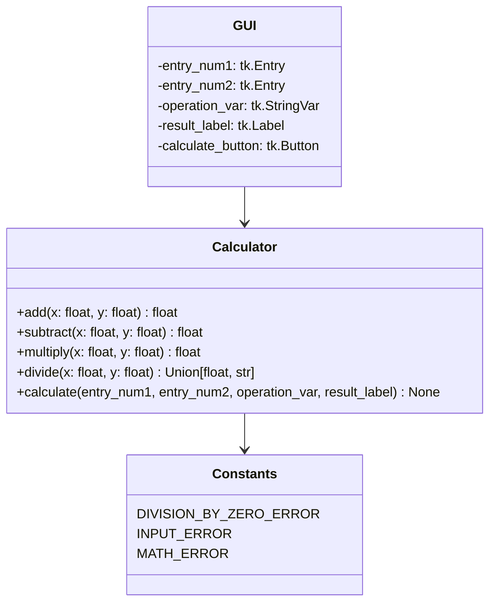
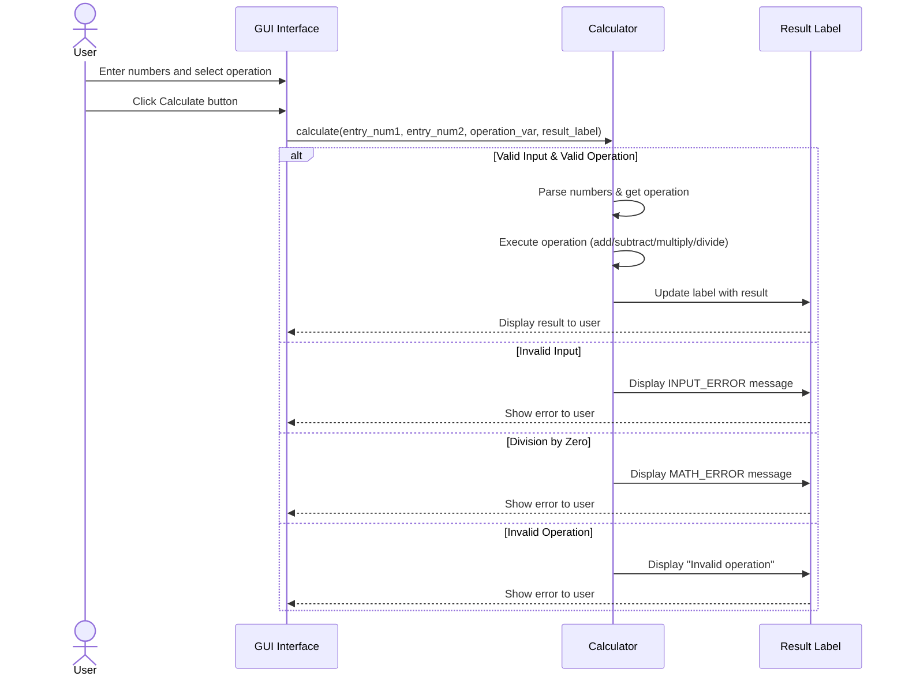
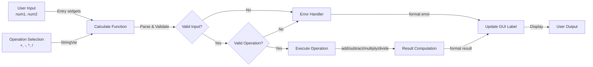
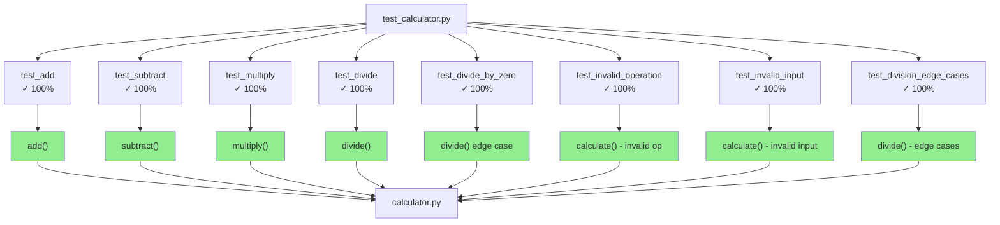

# simplecalc

Simple calculator repo for testing and evaluating possibilities.

## Overview

This project is a Python-based calculator GUI application with comprehensive unit tests and code coverage analysis. It demonstrates modern Python development practices including type hints, error handling, and test-driven development.

## Features

- **Basic Operations**: Addition, subtraction, multiplication, and division
- **Error Handling**: Graceful handling of division by zero and invalid inputs
- **Type Hints**: Full type annotations for improved code quality
- **Comprehensive Tests**: 16 unit tests with coverage tracking
- **GUI Interface**: Built with tkinter

## Installation

### For Development

```bash
# Install in editable mode with dev dependencies
pip install -e ".[dev]"
```

### For Use

```bash
pip install .
```

## Running program

```bash
# After installation
simplecalc

# Or directly from source
python -m simplecalc.calculator
```

## Running tests

### Via unittest

```bash
python -m unittest -v test_calculator.py
```

### Via coverage

```bash
coverage run -m unittest discover && coverage report
```

### Via VSCode

Use the VSCode Test functionality to run and debug tests directly in the editor.

## Architecture Diagrams

### Class Diagram



### Sequence Flow Diagram



### Data Flow Diagram



### Code Coverage Map



## Test Coverage

Current test coverage: **100%** of core calculator functions.

- ✓ All arithmetic operations (add, subtract, multiply, divide)
- ✓ Error handling (division by zero, invalid input)
- ✓ Edge cases (large numbers, floating-point precision)
- ✓ GUI integration (calculate function with mocked components)

## Configuration

The project uses `.coveragerc` for coverage configuration:

- **Branch coverage**: Enabled
- **Source**: Current directory
- **Report**: Shows missing lines and skips covered lines
- **HTML output**: Generated in `coverage_html_report/` directory

## Project Structure

```text
simplecalc/
├── src/
│   └── simplecalc/
│       ├── __init__.py           # Package initialization
│       └── calculator.py         # Main calculator module with GUI
├── tests/
│   ├── __init__.py               # Test package initialization
│   └── test_calculator.py        # Unit tests
├── .github/                      # GitHub configuration and documentation
├── .coveragerc                   # Coverage configuration
├── .flake8                       # Flake8 linter configuration
├── .pre-commit-config.yaml       # Pre-commit hooks configuration
├── pyproject.toml                # Project configuration and dependencies
├── requirements-dev.txt          # Development dependencies
├── README.md                     # This file
└── LICENSE                       # Project license
```

This structure follows Python best practices:

- **src/simplecalc/**: Source code in a package directory
- **tests/**: All tests in a dedicated directory
- **pyproject.toml**: Modern Python project configuration
- **Configuration files**: Linting, formatting, and coverage configs at root

## Documentation

- **[Project Structure Guide](.github/PROJECT_STRUCTURE.md)**: Quick reference for the project layout
- **[Migration Guide](.github/MIGRATION_GUIDE.md)**: Detailed migration from old to new structure
- **[Python Instructions](.github/instructions/python.instructions.md)**: Python-specific guidelines
- **[Evergreen Development](.github/instructions/evergreen-development.instructions.md)**: Best practices

## Future Enhancements

- [ ] Support for additional operations (power, modulo, square root)
- [ ] History of calculations
- [ ] Scientific calculator mode
- [ ] Dark theme support
- [ ] Keyboard input support
- [ ] Configuration file for customization
- [ ] Web interface using Flask/FastAPI
- [ ] REST API for calculator operations
